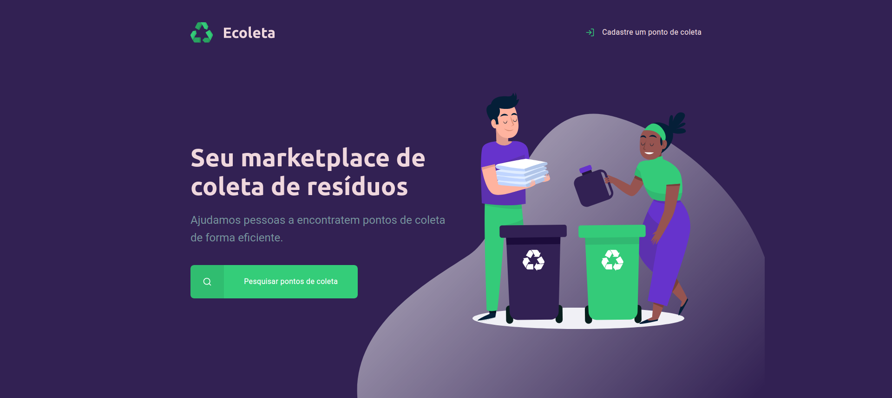

<h3 align="center">
    
    <br><br>
    <b>Recicle! ajude o meio ambiente!</b> 
</h3>

<p align="center">
  

  

  <a href="https://github.com/pjavier98/ecoleta/commits/master">
    
  </a>

  <a href="http://makeapullrequest.com">
    
  </a>

  <a href="https://opensource.org/licenses/MIT">
    
  </a>

  <a href="https://rocketseat.com.br">
    
  </a>
  <a>
  
  </a>
</p>

<h3 align="center" style="margin-top: 50px">
    
    <br>
</h3>

# Índice

- [Índice](#índice)
  - [Sobre](#sobre)
  - [Tecnologias Utilizadas](#tecnologias-utilizadas)
  - [Como usar](#como-usar)
  - [Como contribuir](#como-contribuir)
  - [License](#license)

<a id="sobre"></a>

## Sobre

O <strong>Ecoleta</strong> é uma aplicação Web para ajudar pessoas a encontrarem pontos de coleta para reciclagem.

Essa aplicação foi construída na trilha <strong>Starter</strong> da <strong>Next Level Week</strong> distribuída pela [Rocketseat](https://rocketseat.com.br/). A ideia foi criar um marketplace de coleta de resíduos surgiu da coincidência da data do curso e a data da <strong>semana do meio ambiente</strong>

<a id="tecnologias-utilizadas"></a>

## Tecnologias Utilizadas

O projeto foi desenvolvido utilizando as seguintes tecnologias

- HTML
- CSS
- JS
- Live Server

<a id="como-usar"></a>

## Como usar
1. Faça um clone :

```sh
  $ git clone https://github.com/pjavier98/ecoleta.git

  ou

  $ hub clone pjavier98/ecoleta
```

2. Executando a Aplicação:
```
  Abrir no navegador o arquivo: index.html
```

<a id="como-contribuir"></a>

## Como contribuir

- Faça um Fork desse repositório,
- Crie uma branch com a sua feature: `git checkout -b my-feature`
- Commit suas mudanças: `git commit -m 'feat: My new feature'`
- Push a sua branch: `git push origin my-feature`

## License

Esse projeto está sob a licença MIT. Veja o arquivo [LICENSE](LICENSE.md) para mais detalhes.

---

<h4 align="center">
    Feito com 💜 by <a href="https://www.linkedin.com/in/pedro-javier/" target="_blank">Pedro Javier</a>
</h4>